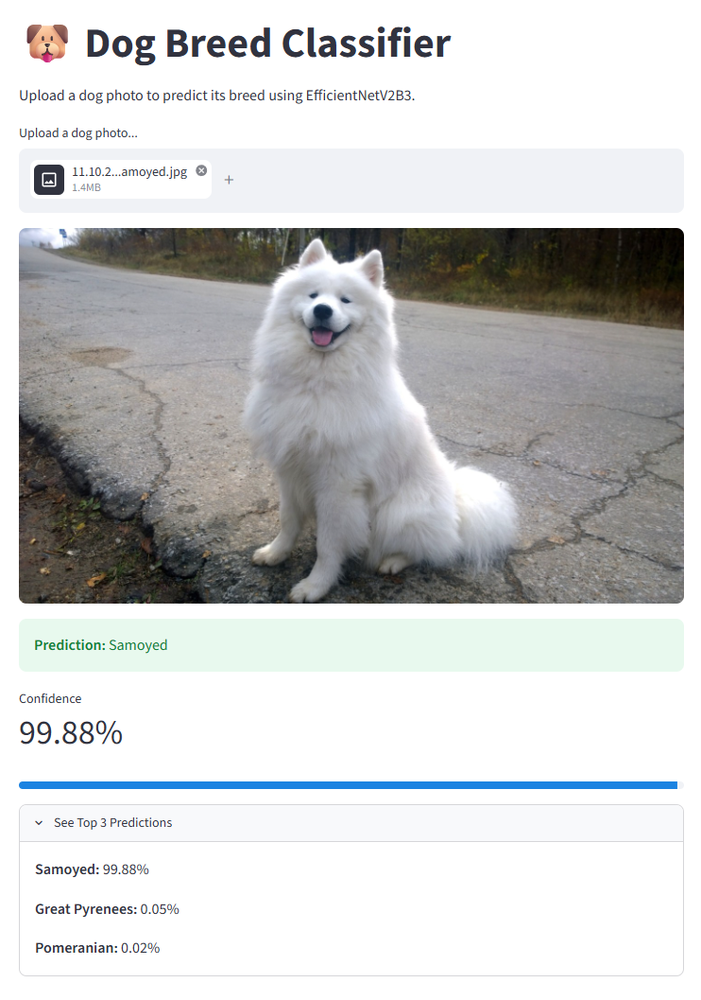
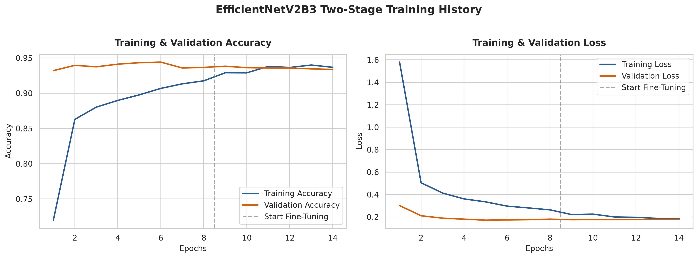
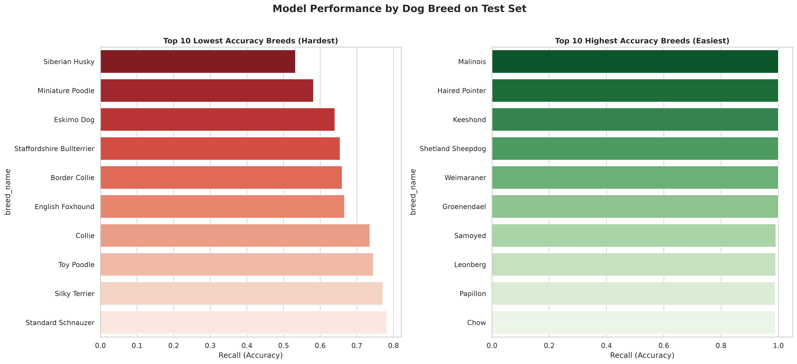

# Dog Vision — Dog Breed Classification with EfficientNetV2 & ONNX

## Overview
Dog Vision CNN is a lightweight, end-to-end computer vision web application designed to classify dog breeds from uploaded images in real time. Built on a fine-tuned EfficientNetV2B3 architecture trained on the Stanford Dogs dataset, the core model reaches high-accuracy predictions across 120 distinct breeds. To optimize performance for cloud deployment, the model was converted to the ONNX (Open Neural Network Exchange) runtime format, drastically reducing memory overhead and inference latency while serving predictions through a clean Streamlit user interface.


> For in-depth details on Exploratory Data Analysis (EDA), Model Selection and Tuning, and Results, please refer to the [Full Technical Report](dog_vision_report.md).

---

## Demo



**Try the Live Interactive Web App:** [Dog Breed Classifier on Streamlit Cloud](https://dog-vision-cnn-ts2zeabpjnpgre2qivmnxg.streamlit.app)

---

## Key Features & Highlights

* **High-Accuracy Fine-Tuned Model:** Utilizes a two-stage transfer learning pipeline with EfficientNetV2B3 to achieve over 93% validation accuracy across 120 dog breeds.

* **Lightweight ONNX Inference Engine:** Deploys an optimized ONNX model instead of heavy deep learning frameworks, dropping system RAM consumption to <50MB for ultra-fast predictions.

* **Interactive Streamlit Web App:** Features a responsive user interface allowing instant image uploads, confidence score metrics, top-3 prediction breakdowns, and visual probability displays.

---

## Key Results

<p align="center">
  
</p>

* **High Classification Performance:** Achieved ~**93.8% validation accuracy** and reduced cross-entropy validation loss to **~0.18** across 120 breeds.
* **Effective Two-Stage Fine-Tuning:** 
  * **Stage 1 (Feature Extraction, Epochs 1–8):** The frozen EfficientNetV2B3 backbone rapidly stabilized, reaching ~92% training accuracy without overfitting.
  * **Stage 2 (Fine-Tuning, Epochs 9–14):** Unfreezing top layers successfully eliminated the initial training/validation gap, converging training and validation metrics smoothly.

<p align="center">
  
</p>

* **Top-Performing Breeds (100% Recall):** Breeds with distinct visual features—such as *Irish Setter, Pembroke, Groenendael, English Springer, Gordon Setter, English Setter, German Short-Haired Pointer, Komondor, Pug,* and *Leonberg*—achieved **perfect 1.0 recall** on the test set.
* **Challenging Breeds:** Visual similarities caused lower accuracy (~65%–70% recall) in closely related pairs or highly variable breeds, such as *Border Collie*, *Eskimo Dog*, *Staffordshire Bull Terrier*, and *Siberian Husky*.

---

## Tech Stack

* **Language:** Python `3.12.3`
* **Data Processing & Analysis:** tensorflow_datasets, Pandas, NumPy
* **Machine Learning:** TensorFlow, Scikit-Learn
* **Visualization:** Matplotlib, Seaborn
* **Model Persistence:** tf2onnx
* **Web Framework:** Streamlit, onnxruntime

---

## Project Structure

```text
dog-vision-CNN/
├── assets/                  # Images for README
├── dog_vision.ipynb         # Complete Transfer Learning pipeline
├── dog_vision_report.md     # Comprehensive technical report
├── app.py                   # Interactive Streamlit web application
├── requirements.txt         # Python dependencies for the web app
├── requirements-dev.txt     # Python dependencies for the notebook
└── README.md                # Project documentation
```

The execution pipeline automatically generates and manages the following runtime directories:

```text
├── data/               # Dataset downloaded from TFDS
├── models/             # Stores trained model files
├── results/            # Stores the model classification report
└── plots/              # Generated visualizations
    ├── eda/            # Exploratory Data Analysis plots
    └── evaluation/     # Visualizations of model evaluation
```

---

## How to Run

First, clone the repository and navigate into the project directory:
```bash
git clone https://github.com/BevisWong76/dog-vision-CNN.git
cd dog-vision-CNN
```

### Option 1: Using Docker (Recommended for Notebook & Training)

If you use Docker, you can run the entire environment (including TensorFlow and Jupyter Notebook) without installing dependencies locally.

1. **Build and start the container:**
   ```bash
   docker compose up -d
   ```

2. **Access the services:**
   * **Streamlit App:** http://localhost:8501
   * **Jupyter Notebook:** http://localhost:8888

---

### Option 2: Using `uv` (Fast Local Setup)

[`uv`](https://github.com/astral-sh/uv) is an ultra-fast Rust-based Python package manager.

1. **Install `uv`** (if not already installed):
   ```bash
   pip install uv
   ```

2. **Set up the virtual environment & dependencies:**

   * **For Web App Only (Lightweight ~50MB):**
     ```bash
     uv venv
     uv pip install -r requirements.txt
     ```

   * **For Full Development & Notebook Training (Includes TensorFlow):**
     ```bash
     uv venv
     uv pip install -r requirements.txt -r requirements-dev.txt
     ```

3. **Activate the environment:**
   * **Windows (PowerShell):** `.venv\Scripts\Activate.ps1`
   * **Windows (CMD):** `.venv\Scripts\activate.bat`
   * **macOS / Linux:** `source .venv/bin/activate`

---

### Option 3: Using Standard Python `venv`

1. **Create and activate virtual environment:**
   ```bash
   python -m venv .venv

   # Windows (PowerShell):
   .venv\Scripts\Activate.ps1

   # macOS / Linux:
   source .venv/bin/activate
   ```

2. **Install dependencies:**

   * **For Web App Only:**
     ```bash
     pip install -r requirements.txt
     ```

   * **For Full Development & Notebook Training:**
     ```bash
     pip install -r requirements.txt -r requirements-dev.txt
     ```

---

### Running the Project Locally

* **Launch the Streamlit Web App:**
  ```bash
  streamlit run app.py
  ```

* **Launch Jupyter Notebook (Requires Dev Dependencies):**
  ```bash
  jupyter notebook
  ```