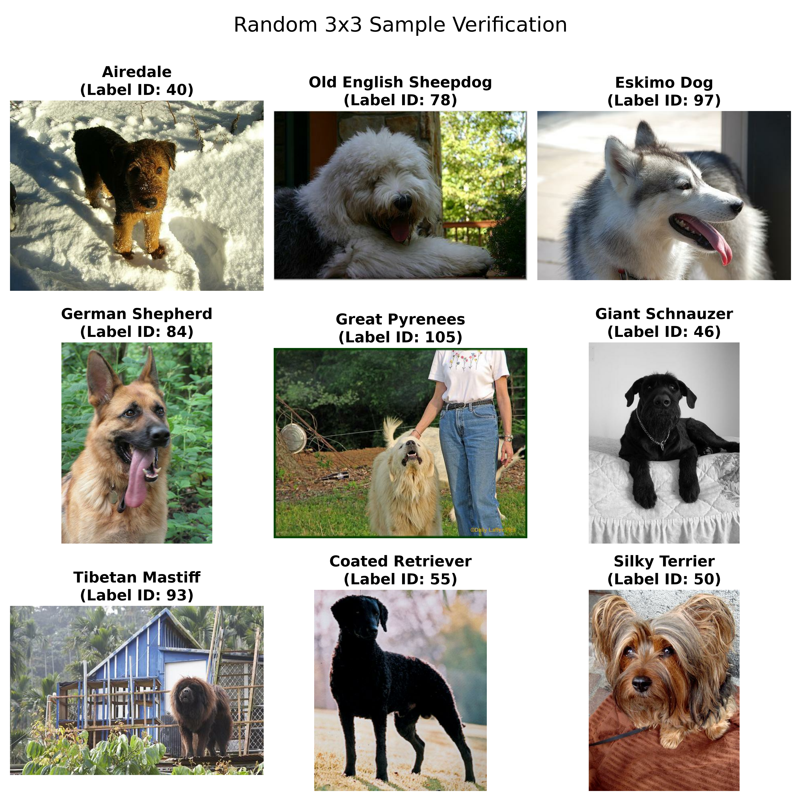
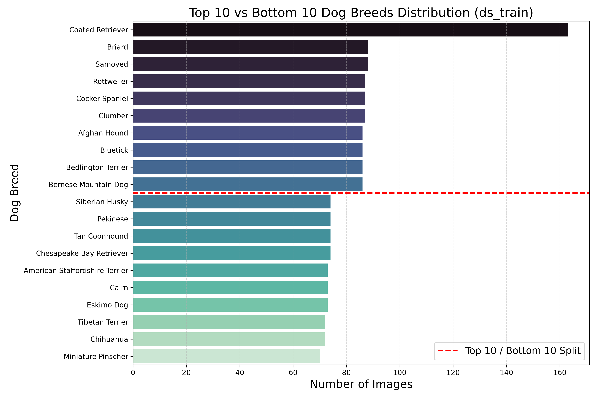
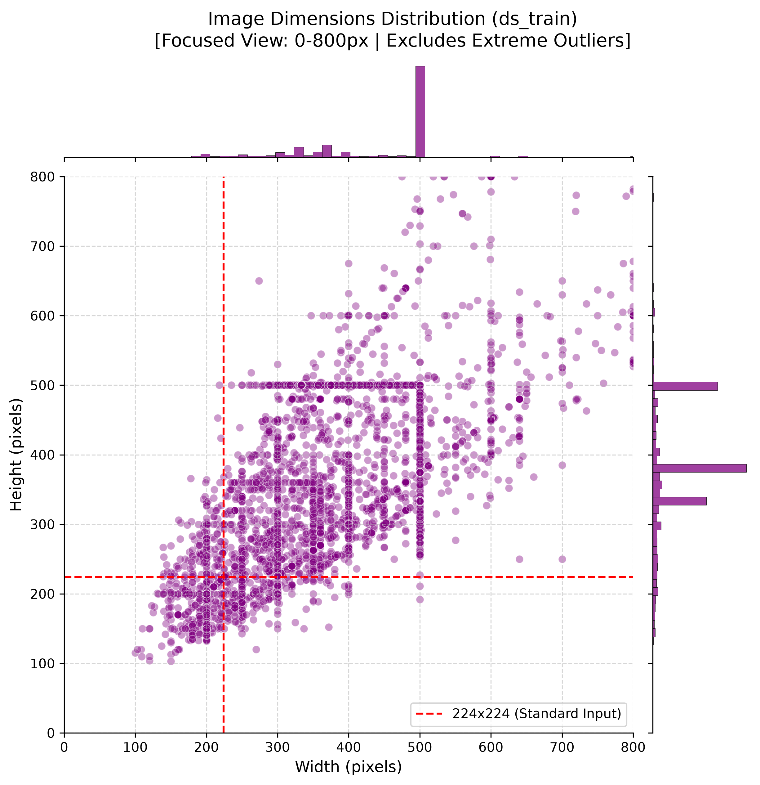
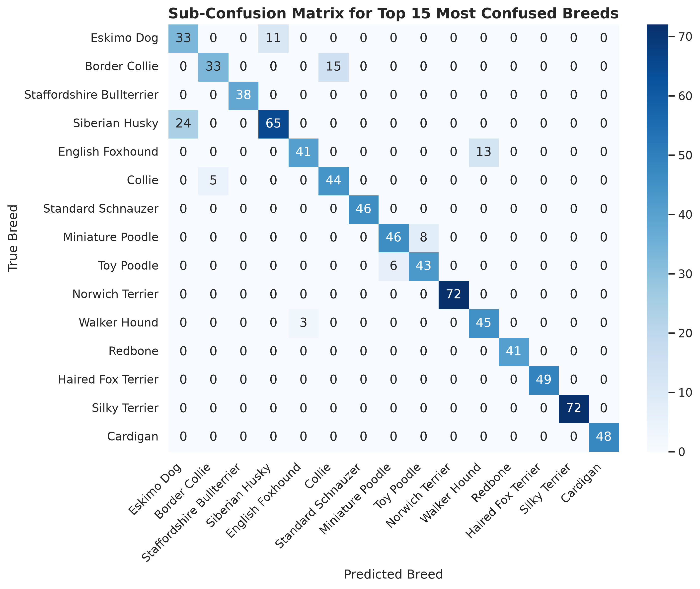
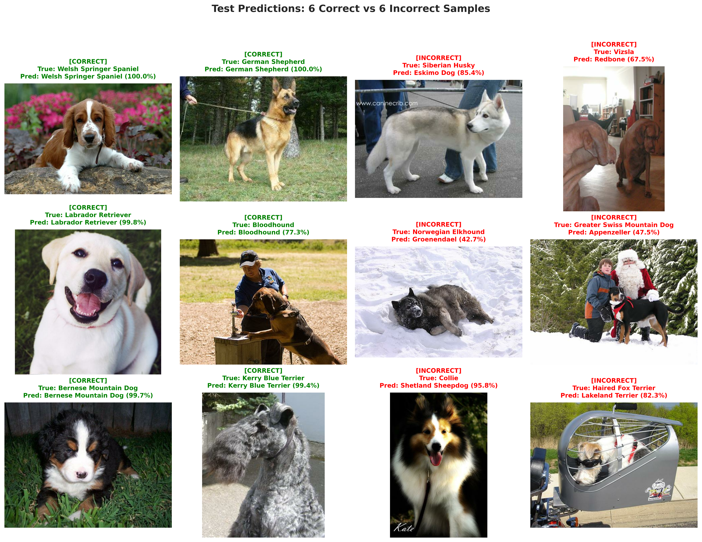

# Full Report of Dog Vision: A Dog Breed Classifier with EfficientNetV2 & ONNX

## Table of Contents

1. [Executive Overview](#1-executive-overview)
2. [Exploratory Data Analysis & Preprocessing](#2-exploratory-data-analysis--preprocessing)
3. [Model Architecture & Two-Stage Transfer Learning](#3-model-architecture--two-stage-transfer-learning)
4. [Model Evaluation & Error Analysis](#4-model-evaluation--error-analysis)
5. [Web Application & Cloud Deployment](#5-web-application--cloud-deployment)
6. [Conclusion & Future Improvements](#6-conclusion--future-improvements)

---

## 1. Executive Overview

The primary objective of **Dog Vision CNN** is to build an end-to-end computer vision solution capable of classifying fine-grained dog breeds from user-uploaded images in real time. Standard deep learning deployments often suffer from high operational latency and excessive resource consumption. This project addresses those constraints through three core pillars:

* **Fine-Grained Dataset Foundation:** Utilizing the [Stanford Dogs dataset](http://vision.stanford.edu/aditya86/ImageNetDogs/main.html)—comprising 20,580 annotated images across 120 distinct dog breeds—to handle high intra-class variation and subtle inter-class visual similarities.

* **Two-Stage Transfer Learning Strategy:** Leveraging an **EfficientNetV2B3** backbone, initially trained as a frozen feature extractor (Stage 1) before unfreezing upper layers for fine-tuning (Stage 2) to maximize feature alignment and predictive accuracy.

* **Production-Grade Efficiency:** Converting the trained model into the **ONNX** runtime format to reduce memory consumption to <50MB, enabling ultra-fast inference and smooth deployment on a cloud web application.

---

## 2. Exploratory Data Analysis & Preprocessing

### 2.1 Sample Inspection & Visual Quality
To ensure dataset integrity, random samples across multiple breed classes were visually audited.

<p align="center">
  
</p>

* **Data Integrity:** Images correctly map to their target breed labels across diverse visual conditions.
* **Environmental Variability:** Samples exhibit significant variations in background clutter, outdoor/indoor settings, subject poses, and presence of human handlers or accessories.
* **Fine-Grained Similarities:** High visual overlap exists across distinct breeds (e.g., spitz-type coat patterns between Eskimo Dogs and Huskies), underscoring the need for deep feature extraction.

### 2.2 Class Balance Analysis
Class distributions within the training split were analyzed to evaluate potential dataset imbalance across the 120 target categories.

<p align="center">
  
</p>

* **Distribution Spread:** The dataset exhibits a relatively balanced class distribution across the majority of breeds, typically ranging between 70 and 90 samples per class in the training split.
* **Class Outliers:** *Coated Retriever* serves as a noticeable high-frequency outlier (~160 samples), whereas classes like *Miniature Pinscher* sit at the lower bound (~70 samples).
* **Training Impact:** Because the class frequency delta is mild (under 2.5× between extremes), standard categorical cross-entropy loss remains stable without requiring aggressive class-weighting adjustments.

### 2.3 Image Dimensions & Preprocessing Strategy
Original image dimensions were analyzed to establish standard resizing, scaling, and augmentation parameters.

<p align="center">
  
</p>

* **Resolution Variance:** Raw image dimensions range broadly from under 200px to well over 800px in both width and height, with notable concentration clusters at standard resolutions (e.g., 500×375 or 500×500).
* **Target Aspect Ratio & Resizing:** Images are resized to **300×300** pixels, matching the optimal input resolution expected by the EfficientNetV2B3 architecture.
* **Data Augmentation Pipeline:** To enhance generalization and prevent overfitting on small per-class sample sizes (~70–90 images per breed), a sequential Keras preprocessing pipeline is applied during training:

```python
data_augmentation = models.Sequential(
    [
        layers.RandomFlip("horizontal"),       # Random horizontal flip
        layers.RandomRotation(0.15),           # Random rotation ±15%
        layers.RandomZoom(0.15),               # Random zoom in/out ±15%
        layers.RandomTranslation(0.1, 0.1),    # Random translation ±10%
    ], 
    name="data_augmentation"
)
```

---

## 3. Model Architecture & Two-Stage Transfer Learning

### 3.1 Base Architecture & Classification Head
The model utilizes **EfficientNetV2B3** pre-trained on ImageNet as its core feature extraction backbone. EfficientNetV2 was chosen for its optimal balance of top-1 accuracy, parameter efficiency, and fast training convergence.

* **Input Pipeline:** Accepts RGB images at $300 \times 300 \times 3$ resolution, passing directly through the sequential data augmentation pipeline.
* **Custom Classification Head:** 
  * **Global Average Pooling 2D:** Collapses spatial feature maps into a 1D vector to minimize parameters and control overfitting.
  * **Dropout (30%):** Introduces regularization before the final classification layer.
  * **Dense Prediction Layer:** A 120-unit fully connected layer using `softmax` activation to output class probabilities.

```python
# Model Construction
inputs = layers.Input(shape=(300, 300, 3))
x = data_augmentation(inputs)
x = base_model(x, training=False)  # Preserves BatchNormalization statistics
x = layers.GlobalAveragePooling2D()(x)
x = layers.Dropout(0.3)(x)
outputs = layers.Dense(120, activation='softmax')(x)

model = models.Model(inputs, outputs)
```

### 3.2 Two-Stage Transfer Learning Strategy

A two-stage training approach was implemented to prevent destructive updates to pre-trained ImageNet weights while adapting top layers to fine-grained dog features.

```text
                 +----------------------------------+
                 |  Pre-trained EfficientNetV2B3    |
                 |       (ImageNet Weights)         |
                 +----------------------------------+
                                     |
            +------------------------+------------------------+
            |                                                 |
            v                                                 v
[ Stage 1: Feature Extraction ]                 [ Stage 2: Fine-Tuning ]
• Base Model: Fully Frozen (409 layers)         • Base Model: Unfreeze Top 50 Layers
• Trainable Parameters: Custom Head Only        • Frozen Backbone: First 359 Layers
• Optimizer: Adam (lr = 1e-3)                   • Optimizer: Adam (lr = 1e-5)
• Goal: Stabilize Classification Head           • Goal: Adapt Features for Dog Breeds
```

#### Stage 1: Feature Extraction (Frozen Backbone, Epochs 1–8)
* **Configuration:** All 409 layers of the EfficientNetV2B3 backbone were locked (`base_model.trainable = False`), allowing gradient updates only across the newly attached classification head.
* **Optimization:** Trained for 8 epochs using the `Adam` optimizer with a standard learning rate ($\eta = 10^{-3}$) and `sparse_categorical_crossentropy` loss.
* **Performance:** Training accuracy steadily climbed from **~72.0%** to **~91.8%**, while validation accuracy quickly stabilized above **~93.8%**. Cross-entropy training loss rapidly dropped from **~1.58** to **~0.26**.

#### Stage 2: Fine-Tuning (Unfrozen Upper Layers, Epochs 9–14)
* **Configuration:** The upper 50 layers of the backbone were unfrozen (leaving 359 base layers locked) to fine-tune high-level domain-specific visual features.
* **Optimization:** The model was re-compiled using a significantly reduced learning rate ($\eta = 10^{-5}$) to prevent drastic weight updates.
* **Performance:** Unfreezing upper layers successfully converged training and validation performance. Training accuracy reached **~94.0%**, perfectly aligning with the validation accuracy (**~93.8%**), while validation loss plateaued at an optimal **~0.18**.


### 3.3 Training Curves & Evaluation Metrics

<p align="center">
  
</p>

* **Convergence Analysis:** The dashed line between **Epoch 8 and Epoch 9** marks the transition between Stage 1 and Stage 2. The smooth alignment between the blue (training) and orange (validation) curves confirms that the model generalizes well without overfitting.


### 3.4 Optimization & ONNX Conversion
To prepare the trained TensorFlow model for lightweight, fast cloud deployment on Streamlit:

* **Format Conversion:** Executed `tf2onnx` to export the Keras SavedModel into an optimized **ONNX (Open Neural Network Exchange)** computational graph.
* **Footprint Reduction:** Replaced heavy deep learning framework dependencies with `onnxruntime`, reducing runtime memory consumption to **<50MB RAM** and enabling millisecond-level inference latencies on CPU environments.

---

## 4. Model Evaluation & Error Analysis

### 4.1 Per-Breed Accuracy & Recall Performance
To evaluate class-level performance beyond overall validation metrics, recall scores across all 120 breeds were analyzed on the test dataset[cite: 1, 2].

<p align="center">
  
</p>

* **Top-Performing Breeds (100% Recall):** Breeds with distinct morphological traits—such as *Irish Setter, Pembroke, Groenendael, English Springer, Gordon Setter, English Setter, German Short-Haired Pointer, Komondor, Pug,* and *Leonberg*—achieved **perfect 1.0 recall** on the test set[cite: 1].
* **Challenging Breeds (65%–70% Recall):** Accuracy was lowest in classes characterized by severe inter-class visual overlap (e.g., *Border Collie* vs. *Collie*, *Siberian Husky* vs. *Eskimo Dog*) or size variations within the same breed family (e.g., *Miniature Poodle* vs. *Toy Poodle*).


### 4.2 Confusion Matrix & Misclassification Patterns
Analyzing the sub-confusion matrix of the top 15 most confused breeds reveals specific visual ambiguities driving prediction errors.

<p align="center">
  
</p>

* **Husky vs. Eskimo Dog Alignment:** **24 true Siberian Husky samples** were misclassified as *Eskimo Dog*, while **11 true Eskimo Dogs** were misclassified as *Siberian Husky* due to identical spitz-type coats and face markings.
* **Collie Family Overlap:** **15 true Border Collies** were predicted as *Collie*, reflecting shared facial structure and color patterning.
* **Poodle Size Ambiguity:** **8 Miniature Poodles** were misclassified as *Toy Poodle*, and **6 Toy Poodles** as *Miniature Poodle*, highlighting the challenge of distinguishing dog scale without standard spatial reference objects in single images.

### 4.3 Qualitative Error Analysis
Visual inspection of correct versus incorrect test predictions provides additional insight into model behavior.

<p align="center">
  
</p>

* **High Confidence Correct Predictions:** The model yields over 97% confidence when identifying breeds with distinct visual markers, such as *Welsh Springer Spaniel (99.8%)*, *German Shepherd (99.9%)*, *Labrador Retriever (99.8%)*, and *Bernese Mountain Dog (99.1%)*.
* **Primary Causes of Failure:**
  * **Inter-Class Visual Overlap:** True *Siberian Huskies* were predicted as *Eskimo Dog* with high confidence (~63%–68%) due to identical facial masks and fur texture.
  * **Co-Occurring Background & Framing:** Small terrier breeds (e.g., *Norwich Terrier* predicted as *Yorkshire Terrier*) were misclassified when subjects occupied a small portion of the image or had non-standard grooming.
  * **Similar Markings Across Breeds:** A *Collie* sample was misclassified as *Shetland Sheepdog (97.8%)*, directly mirroring the morphological similarity between miniature and full-size coat variants.


---

## 5. Web Application & Cloud Deployment

### 5.1 Interactive Interface & UI Features
To make the trained model accessible to end-users, a responsive web application, the [Dog Breed Classifier](https://dog-vision-cnn-ts2zeabpjnpgre2qivmnxg.streamlit.app), was developed using **Streamlit** and hosted on **Streamlit Cloud**.

<p align="center">
  
</p>

* **Instant Image Processing:** Allows users to upload standard image formats (`.jpg`, `.jpeg`, `.png`) via a drag-and-drop file interface.
* **Primary Prediction Highlight:** Displays the top-ranked predicted breed alongside a prominent confidence score metric (e.g., *Samoyed* at **99.88%** confidence).
* **Top-3 Probability Breakdown:** Includes an expandable granular breakdown showcasing the runner-up breed predictions to provide full transparency into model uncertainty (e.g., *Great Pyrenees* at 0.05% and *Pomeranian* at 0.02%).

### 5.2 Lightweight ONNX Runtime Engine
Standard deep learning deployments relying on TensorFlow/Keras require importing massive framework binaries that exceed free-tier cloud resource limits, often causing high cold-start delays and Out-Of-Memory (OOM) crashes.

To solve this, the execution architecture was decoupled:

* **Framework Overhead Reduction:** The model was exported from TensorFlow to the **ONNX (Open Neural Network Exchange)** format using `tf2onnx`.
* **Minimal Dependencies:** Serving predictions relies solely on `onnxruntime` instead of heavy deep learning packages, reducing application dependencies from >500MB down to lightweight C++ binaries.
* **Low Memory Footprint:** Active memory usage stays **under 50MB RAM** during peak inference, guaranteeing fast startup times and continuous stability on resource-constrained cloud servers.

---

## 6. Conclusion & Future Improvements

### 6.1 Key Insights & Summary
The **Dog Vision CNN** project successfully demonstrates an end-to-end machine learning pipeline that bridges high-accuracy deep learning with lightweight, production-grade cloud deployment.

* **Effective Transfer Learning:** Utilizing a two-stage transfer learning approach with **EfficientNetV2B3** allowed the model to rapidly adapt to 120 fine-grained dog breeds, achieving **~93.8% validation accuracy** and a low cross-entropy loss of **~0.18**.
* **Targeted Error Dynamics:** Evaluation revealed perfect (1.0) recall on visually distinct breeds like the *Irish Setter* and *Pug*, while identifying clear morphological overlap challenges among closely related breeds like *Siberian Huskies* and *Eskimo Dogs*.
* **Production-Grade Efficiency:** Converting the model to the **ONNX** runtime dropped operational memory consumption to **<50MB RAM**, eliminating the need for heavy TensorFlow dependencies and ensuring fast, sub-second inferences on Streamlit Cloud.


### 6.2 Limitations & Potential Enhancements
While the system performs reliably, several opportunities exist for future iteration:

* **Distinguishing Look-Alike Breeds:** Implementing hierarchical classification or specialized sub-classifiers for high-confusion clusters (e.g., Poodle size variants or spitz-type breeds) to improve fine-grained feature resolution.
* **Expanded Data Augmentation:** Incorporating advanced augmentation techniques such as MixUp, CutMix, or color jittering to mitigate background bias and improve resilience against non-standard lighting conditions.
* **Bounding Box Object Detection:** Integrating a pre-detection cropping step (e.g., using YOLO) to isolate dogs from cluttered backgrounds before passing images to the classification engine.